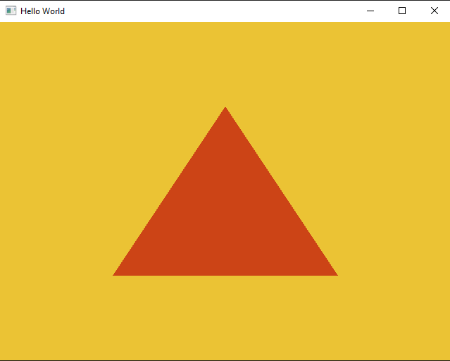

# Graphics Renderer

A simple project to understand some basics about how to render graphics using openGL.

I used GLFW for window creation, and GLAD for getting the specific function pointers used with openGL.

I plan to expand this project greatly. Currently, it only renders a simple triangle on a window. My hope is a more complex 3D graphics renderer eventually.

I used Visual Studio to create and build the project. Currently unsure how to allow others to build and run this project; I believe
using CMake is the simplest solution that I will look into soon.

